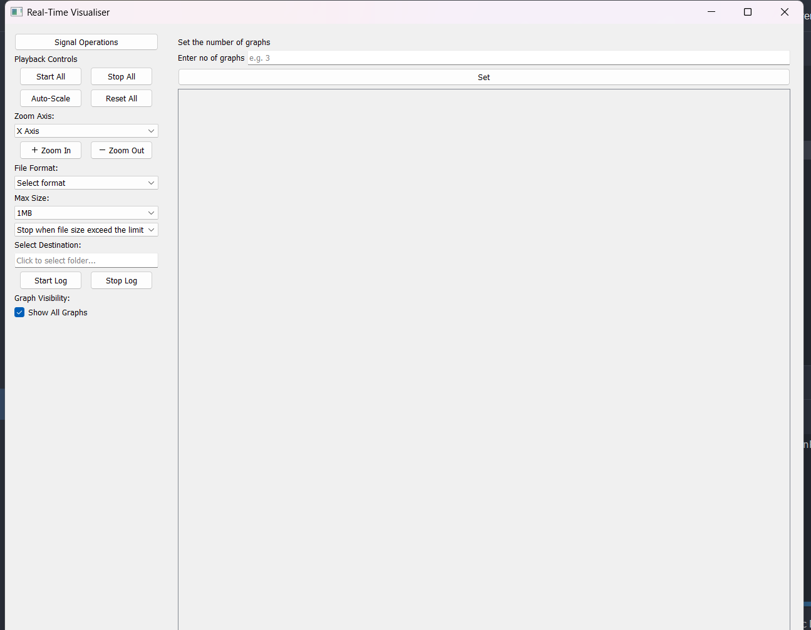
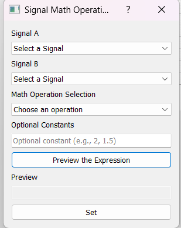
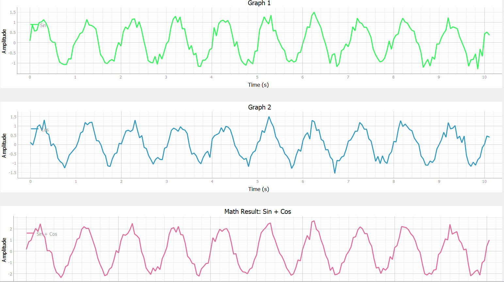
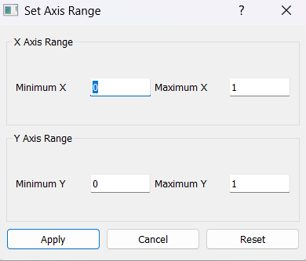
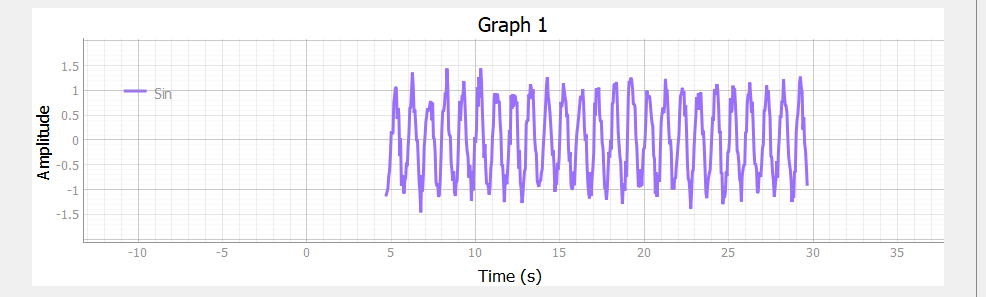
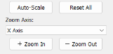
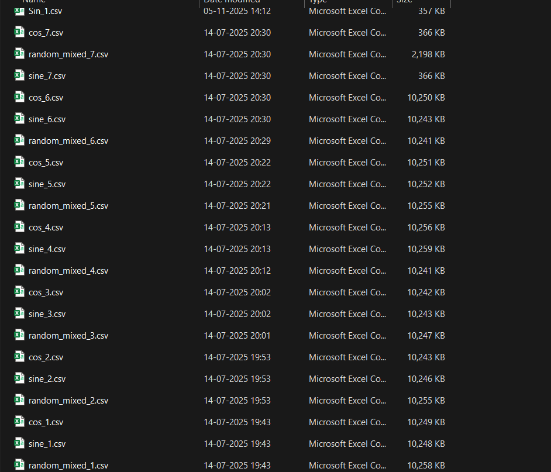

<h1>Real-Time Data Visualizer & Logger ⚡</h1>

A PyQt5-based real-time multi-signal visualizer, math processor, and data logger.

<h2>📌 Project Overview</h2>

This application is a desktop tool built using <strong>PyQt5</strong> and <strong>pyqtgraph</strong>
for real-time acquisition, visualization, and logging of simulated signals.  
It supports modular plotting, live mathematical operations, and flexible CSV/Binary logging.

<h2>✨ Key Features</h2>

<h3>1. Real-Time Multi-Signal Visualization</h3>
<ul>
  <li>Display multiple live graphs simultaneously.</li>
  <li>Each graph uses a dedicated <code>QThread</code> with a <code>DataWorker</code>.</li>
  <li>Global controls for Start All, Stop All, Reset All.</li>
</ul>

<h3>2. Advanced Signal Math Operations</h3>
<ul>
  <li>Perform A+B, A−B, sin(A), cos(B), sin(A)+2B, etc.</li>
  <li>Math results appear as new live plots.</li>
  <li>NumPy-based vectorized computation.</li>
</ul>

<h3>3. Robust Data Logging</h3>
<ul>
  <li>Supports <strong>CSV</strong> and <strong>Binary</strong> logging.</li>
  <li>Automatic file rotation based on size limits.</li>
  <li>Optimized logging with minimal disk I/O.</li>
</ul>
<h3>4. Interactive Plot Controls</h3>
<ul>
  <li>Zoom, autoscale, and manual axis range settings.</li>
  <li>Right-click context menus for detailed configuration.</li>
  <li>Toggle visibility of individual signals.</li>
</ul>

<h3>4.1 Zoom & Axis Controls</h3>

  <figure style="
      text-align: center;
      border: 1px solid #aaa;
      border-radius: 8px;
      padding: 15px;
      background: #f8f8f8;
    ">
    
    <figcaption style="margin-top: 10px;">
      <em>Figure 1: Individual zoom controls for each plot.</em>
    </figcaption>
  </figure>

  <figure style="
      text-align: center;
      border: 1px solid #aaa;
      border-radius: 8px;
      padding: 15px;
      background: #f8f8f8;
    ">
    
    <figcaption style="margin-top: 10px;">
      <em>Figure 2: Zoom applied along the X-axis.</em>
    </figcaption>
  </figure>

  <figure style="
      text-align: center;
      border: 1px solid #aaa;
      border-radius: 8px;
      padding: 15px;
      background: #f8f8f8;
    ">
    
    <figcaption style="margin-top: 10px;">
      <em>Figure 3: Zoom applied along the Y-axis.</em>
    </figcaption>
  </figure>

  <figure style="
      text-align: center;
      border: 1px solid #aaa;
      border-radius: 8px;
      padding: 15px;
      background: #f8f8f8;
    ">
    
    <figcaption style="margin-top: 10px;">
      <em>Figure 4: Universal zoom affecting both axes.</em>
    </figcaption>
  </figure>

<h2> Technology Stack</h2>
<table border="1" cellpadding="6" cellspacing="0">
<tr><th>Library</th><th>Version</th><th>Purpose</th></tr>
<tr><td>PyQt5</td><td>≥ 5.15</td><td>GUI Framework</td></tr>
<tr><td>pyqtgraph</td><td>≥ 0.13</td><td>High-performance plotting</td></tr>
<tr><td>NumPy</td><td>≥ 1.21</td><td>Vectorized computation</td></tr>
</table>

<h2>⚙️ Architecture Overview</h2>

<h3>1. Multi-Threading</h3>
<ul>
  <li><code>DataWorker</code> runs in separate threads.</li>
  <li>Generates data at fixed intervals (dt = 0.05s).</li>
  <li>Uses circular buffers (max 500 points).</li>
</ul>

<h3>2. Modular Plot System</h3>
<ul>
  <li><code>Generate_Graph</code> manages plot creation/removal.</li>
  <li><code>GraphWidget</code> handles updates using <code>curve.setData()</code>.</li>
</ul>

<h3>3. Logging Engine</h3>
<ul>
  <li><code>DataLogger</code> manages CSV and binary writes.</li>
  <li>Supports file rotation and size management.</li>
</ul>

<h3>4. Live Math Plotting</h3>
<ul>
  <li>UI-driven expression builder.</li>
  <li>Continuous recomputation using <code>QTimer.singleShot()</code>.</li>
</ul>

<h2>📊 Results & Demonstration</h2>

<h3>Data Logging Output</h3>

<h2>🧪 Testing & Validation</h2>
<ul>
  <li>Tested with up to 50 real-time plots at 20Hz.</li>
  <li>No GUI blocking due to isolated QThreads.</li>
  <li>Circular buffers prevent memory overflow.</li>
  <li>Logging checked for timestamp-value consistency.</li>
</ul>

<h2>📂 Repository Structure</h2>

<pre>

Real-Time-Data-Visualizer-and-Logger
│
├─ README.md
├─ requirements.txt
├─ main.py
│
├─ images/
│  ├─ multi_plots.png
│  └─ user_interface.png
│
├─ graph_plotting_functionalities/
│  ├─ AxisRangeDialog.py
│  ├─ Graph_Layout.py
│  ├─ Graph_Template.py
│  ├─ Random-mixed signal.py
│  ├─ graph_widget.py
│  └─ plotting.py
│
├─ src/
│  ├─ __init__.py
│  ├─ app.py
│  ├─ data_acquisition.py
│  ├─ data_logger.py
│  ├─ data_worker.py
│  ├─ math_functions.py
│  ├─ Math_Dialog.py
│  ├─ replay.py
│  └─ utils.py
│
└─ ui/
   ├─ main_window.py
   └─ main_window.ui
</pre>

